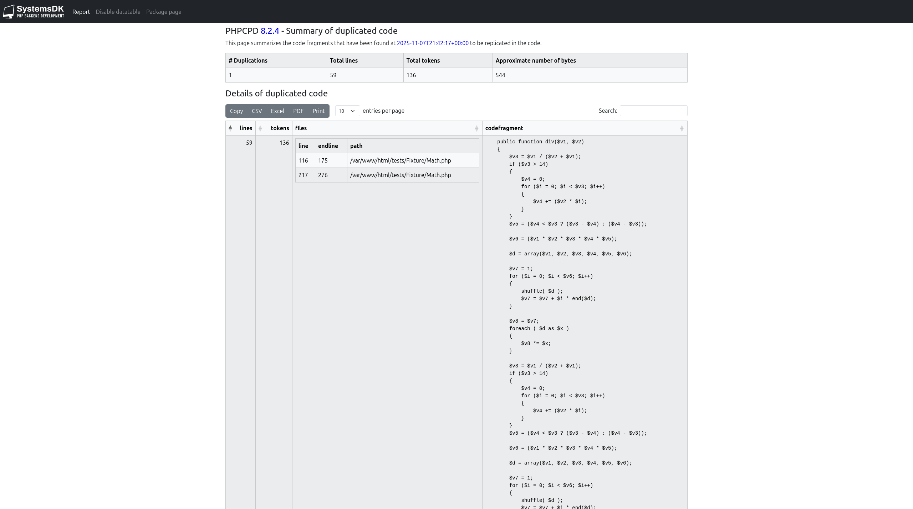

# PHP Copy/Paste Detector report
This document describing how you can generate report.

## Requirements for html report generation
* [Xalan](https://xalan.apache.org) tool
* created folder (f.e. `reports/phpcpd`) with write access where you want to save your report

Note: You can find some already-made examples inside our solutions on our [GitHub page](https://github.com/systemsdk) 

## Steps for html report generation
You need to run the next commands for html report generation:

1. Run PHP Copy/Paste Detector
```bash
php ./vendor/bin/phpcpd --fuzzy --verbose --log-pmd=reports/phpcpd/phpcpd-report-v1.xml src
```

Note: `src` is a folder where your php source code for analyzing

2. Run xalan tool for report generation
```bash
xalan -in reports/phpcpd/phpcpd-report-v1.xml -xsl https://systemsdk.github.io/phpcpd/report/phpcpd-html-v1_0_0.xslt -out reports/phpcpd/phpcpd-report-v1.html
```

3. Now you can open the report using your web-browser



[Example](https://systemsdk.github.io/phpcpd/report/report-example.html)

Note: Please use menu items `Enable datatable`, `Disable datatabl` for enable/disable [DataTables](https://datatables.net/).

## Xml report format
This format uses `xml` to output the duplications in a more structured format. The `xml` format can then further be processed using `xslt` transformations. See section xslt below for examples.

Report file example:
```
<?xml version="1.0" encoding="UTF-8"?>
<pmd-cpd xmlns="https://systemsdk.github.io/phpcpd/report" xmlns:xsi="http://www.w3.org/2001/XMLSchema-instance" phpcpdVersion="8.2.3" timestamp="2025-05-25T16:09:03+00:00" version="1.0.0" xsi:schemaLocation="https://systemsdk.github.io/phpcpd/report https://systemsdk.github.io/phpcpd/report/phpcpd-report-v1_0_0.xsd">
  <duplication lines="59" tokens="136">
    <file line="116" endline="175" path="/var/www/html/tests/Fixture/Math.php"/>
    <file line="217" endline="276" path="/var/www/html/tests/Fixture/Math.php"/>
    <codefragment><![CDATA[    public function div($v1, $v2)
    {
        $v3 = $v1 / ($v2 + $v1);
        if ($v3 > 14)
        {
            $v4 = 0;
            for ($i = 0; $i < $v3; $i++)
            {
                $v4 += ($v2 * $i);
            }
        }
        $v5 = ($v4 < $v3 ? ($v3 - $v4) : ($v4 - $v3));

        $v6 = ($v1 * $v2 * $v3 * $v4 * $v5);

        $d = array($v1, $v2, $v3, $v4, $v5, $v6);

        $v7 = 1;
        for ($i = 0; $i < $v6; $i++)
        {
            shuffle( $d );
            $v7 = $v7 + $i * end($d);
        }

        $v8 = $v7;
        foreach ( $d as $x )
        {
            $v8 *= $x;
        }

        $v3 = $v1 / ($v2 + $v1);
        if ($v3 > 14)
        {
            $v4 = 0;
            for ($i = 0; $i < $v3; $i++)
            {
                $v4 += ($v2 * $i);
            }
        }
        $v5 = ($v4 < $v3 ? ($v3 - $v4) : ($v4 - $v3));

        $v6 = ($v1 * $v2 * $v3 * $v4 * $v5);

        $d = array($v1, $v2, $v3, $v4, $v5, $v6);

        $v7 = 1;
        for ($i = 0; $i < $v6; $i++)
        {
            shuffle( $d );
            $v7 = $v7 + $i * end($d);
        }

        $v8 = $v7;
        foreach ( $d as $x )
        {
            $v8 *= $x;
        }

        return $v8;
]]></codefragment>
  </duplication>
</pmd-cpd>
```

## Xslt
This is not a direct report format. But you can use one of the following `xslt` stylesheets to convert the report into `html`. Or you can write your own stylesheet.

`https://systemsdk.github.io/phpcpd/report/phpcpd-html-v1_0_0.xslt`

This stylesheet is available and using for html report generation mentioned above.

It requires javascript enabled and uses [Bootstrap](https://getbootstrap.com/), [jQuery](https://jquery.com/), and [DataTables](https://datatables.net/).

## Schema versions
PHP Copy/Past detector tool is building xml report that has schema `https://systemsdk.github.io/phpcpd/report/phpcpd-report-v1_0_0.xsd`.

You can find xsd versions history [here](schema.md).
