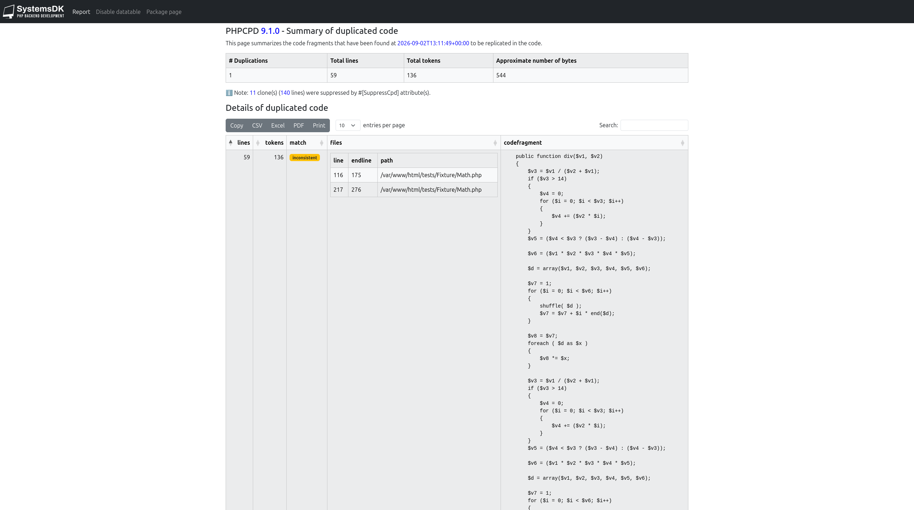

# HTML Report Generation
This document describes how to generate visual, interactive HTML reports from `phpcpd`'s XML output. These reports make it significantly easier to navigate, analyze, and share code duplication metrics with your team.

## Requirements
To generate HTML reports, ensure you have the following:
* The [Xalan](https://xalan.apache.org) XSLT processor installed locally or within your Docker container.
* A dedicated output directory (e.g., `reports/phpcpd/`) with write permissions.

Note: You can find fully configured examples within the open-source projects hosted on our [GitHub page](https://github.com/systemsdk).

## Generation Steps
Follow these steps to analyze your code and compile the HTML report:

1. Run PHPCPD to generate an XML report
```bash
php ./vendor/bin/phpcpd --fuzzy --verbose --log-pmd=reports/phpcpd/phpcpd-report-v1.xml src
```

Note: In this example, `src` represents the directory containing the PHP source code you wish to analyze.

2. Run Xalan to convert the XML into HTML
```bash
xalan -in reports/phpcpd/phpcpd-report-v1.xml -xsl https://systemsdk.github.io/phpcpd/report/phpcpd-html-v1_0_0.xslt -out reports/phpcpd/phpcpd-report-v1.html
```

3. View the Report
Open the newly generated `reports/phpcpd/phpcpd-report-v1.html` file in any modern web browser.

You can view a live [Example Report here](https://systemsdk.github.io/phpcpd/report/report-example.html).



Tip: Use the `Enable datatable` and `Disable datatable` menu items at the top of the HTML report to toggle the interactive [DataTables](https://datatables.net/) grid for advanced sorting and searching.

## XML Report Format
Under the hood, `phpcpd` outputs the duplications in a structured `XML` format. This structured data can then be processed further using XSLT transformations.

Here is an example of the generated XML output:
```xml
<?xml version="1.0" encoding="UTF-8"?>
<pmd-cpd xmlns="https://systemsdk.github.io/phpcpd/report" xmlns:xsi="http://www.w3.org/2001/XMLSchema-instance" suppressedClones="11" suppressedLines="140" phpcpdVersion="9.1.0" timestamp="2026-09-02T13:11:49+00:00" version="1.0.0" xsi:schemaLocation="https://systemsdk.github.io/phpcpd/report https://systemsdk.github.io/phpcpd/report/phpcpd-report-v1_0_0.xsd">
    <duplication lines="59" tokens="136" exact="false">
        <file line="116" endline="175" path="/var/www/html/tests/Fixture/Math.php"/>
        <file line="217" endline="276" path="/var/www/html/tests/Fixture/Math.php"/>
        <codefragment><![CDATA[    public function div($v1, $v2)
    {
        $v3 = $v1 / ($v2 + $v1);
        if ($v3 > 14)
        {
            $v4 = 0;
            for ($i = 0; $i < $v3; $i++)
            {
                $v4 += ($v2 * $i);
            }
        }
        $v5 = ($v4 < $v3 ? ($v3 - $v4) : ($v4 - $v3));

        $v6 = ($v1 * $v2 * $v3 * $v4 * $v5);

        $d = array($v1, $v2, $v3, $v4, $v5, $v6);

        $v7 = 1;
        for ($i = 0; $i < $v6; $i++)
        {
            shuffle( $d );
            $v7 = $v7 + $i * end($d);
        }

        $v8 = $v7;
        foreach ( $d as $x )
        {
            $v8 *= $x;
        }

        $v3 = $v1 / ($v2 + $v1);
        if ($v3 > 14)
        {
            $v4 = 0;
            for ($i = 0; $i < $v3; $i++)
            {
                $v4 += ($v2 * $i);
            }
        }
        $v5 = ($v4 < $v3 ? ($v3 - $v4) : ($v4 - $v3));

        $v6 = ($v1 * $v2 * $v3 * $v4 * $v5);

        $d = array($v1, $v2, $v3, $v4, $v5, $v6);

        $v7 = 1;
        for ($i = 0; $i < $v6; $i++)
        {
            shuffle( $d );
            $v7 = $v7 + $i * end($d);
        }

        $v8 = $v7;
        foreach ( $d as $x )
        {
            $v8 *= $x;
        }

        return $v8;
]]></codefragment>
    </duplication>
</pmd-cpd>
```

## XSLT Stylesheets
While XML is the direct report format, you can use XSLT stylesheets to convert the report into HTML.

We provide an official, ready-to-use XSLT stylesheet: `https://systemsdk.github.io/phpcpd/report/phpcpd-html-v1_0_0.xslt`.

This stylesheet is utilized in the generation example above. It requires JavaScript to be enabled and uses [Bootstrap](https://getbootstrap.com/), [jQuery](https://jquery.com/), and [DataTables](https://datatables.net/) to provide a responsive user interface.

Tip: Alternatively, you are free to write and apply your own custom XSLT stylesheet to match your internal corporate branding.

## Schema Versions
The PHP Copy/Paste Detector generates XML reports that strictly adhere to the following schema: `https://systemsdk.github.io/phpcpd/report/phpcpd-report-v1_0_0.xsd`.

For details regarding schema version history and specifications, please refer to the [Schema Documentation](schema.md).
